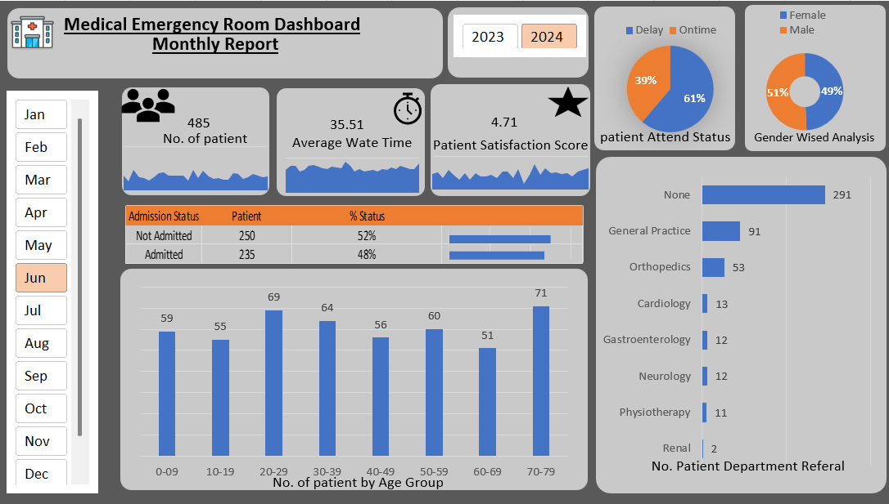

# Hospital Emergency Room Dashboard

## 📊 Project Overview

This project is a Hospital Emergency Room Dashboard created as a Data Analyst project. It analyzes emergency room patient data and provides insights into patient volume, waiting time, admission status, demographics, referrals, and overall emergency department performance.

## 🛠️ Tools Used

- Microsoft Excel
- Pivot Tables
- Pivot Charts
- Excel Dashboard
- Data Cleaning
- Data Analysis
- Data Visualization

## 📈 Key Analysis

- Total number of patients
- Average patient wait time
- Patient admission status
- Patient demographics
- Department referrals
- Patient satisfaction
- Monthly/weekly patient trends
- Emergency room performance

## 🎯 Objective

The objective of this project is to transform raw hospital emergency room data into meaningful insights through data cleaning, analysis, and interactive dashboard visualization.

## 📁 Dataset

The project uses an emergency room dataset for analytical and dashboard development purposes.
